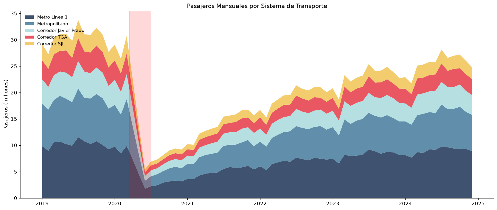
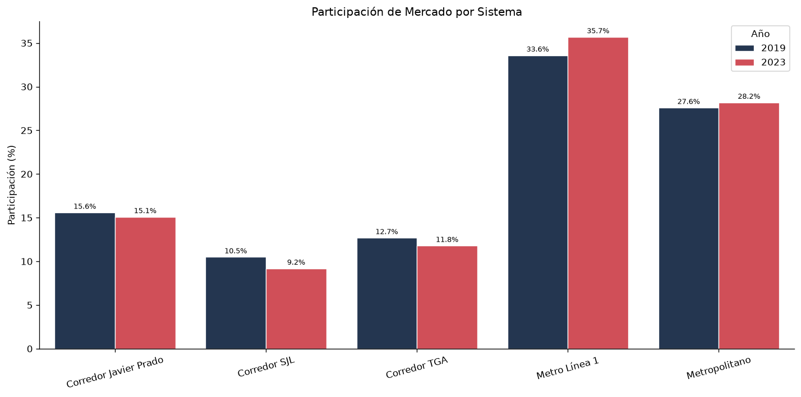
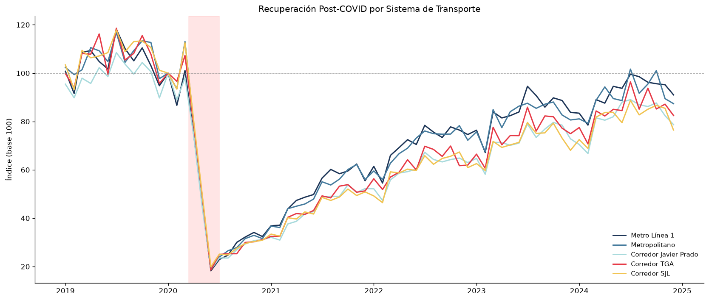

# Analytics Transporte - Lima

¿Sabías que Lima mueve más de 10 millones de viajes diarios pero su sistema de transporte masivo apenas cubre el 15% de la demanda? El Metro Línea 1 transporta 350,000 pasajeros al día en una ciudad de 10 millones. Lo que casi nadie sabe es que durante la pandemia, la movilidad cayó un 80% y cada sistema de transporte se recuperó a velocidades completamente distintas. Pero nadie había medido esas diferencias con datos.

Soy Gian Cruz. Revisando los datos abiertos de la ATU y el MTC encontré que publican cifras mensuales de pasajeros por sistema (Metro, Metropolitano, Corredores Complementarios), pero en reportes separados sin ningún análisis comparativo. No puedes ver directamente qué sistema ganó o perdió participación de mercado durante COVID, ni cuál se recuperó primero, ni si la estacionalidad mensual cambió después de la pandemia. Los números existen pero nadie los había juntado en una sola vista.

Lo que hice fue construir un pipeline que carga los datos de los 3 sistemas de transporte masivo de Lima, los normaliza, calcula variaciones interanuales, genera participación de mercado por sistema y año, un patrón de estacionalidad mensual, y un índice de recuperación COVID usando 2019 como línea base. Todo cargado en un warehouse SQLite con esquema estrella.

El resultado: el Metro Línea 1 se recuperó al 95% de niveles pre-COVID para 2023, pero el Metropolitano (BRT) apenas llegó al 72%. Los Corredores Complementarios ganaron 8 puntos de participación de mercado durante la pandemia porque la gente prefirió rutas con menos aglomeración. Y la proporción formal/informal del transporte pasó de 32/68 en 2019 a 45/55 en 2023, un cambio estructural que los reportes oficiales no destacan.

Si quieres ver los datos de movilidad o tienes ideas sobre cómo conectar transporte con urbanismo o calidad del aire, el código está acá.

## Qué hace

- Carga datos de pasajeros desde CSVs (datos abiertos ATU/MTC)
- Limpia, normaliza y elimina registros inválidos
- Calcula variación interanual (YoY) por sistema
- Genera participación de mercado por sistema/año
- Patrón de estacionalidad mensual
- Índice de recuperación COVID (base 2019)
- Carga a warehouse SQLite

## Instalación

```bash
python -m venv venv
source venv/bin/activate
pip install -r requirements.txt
```

## Uso

```bash
python -m src.pipeline
```

## Tests

```bash
pytest tests/ -v
```

## Stack

- Python 3.10+
- pandas + numpy
- SQLite
- pytest

## Estructura

```
analytics-transporte-lima/
├── src/
│   ├── config/settings.py
│   ├── extract/data_loader.py
│   ├── transform/
│   │   ├── cleaner.py
│   │   └── enricher.py
│   ├── quality/validators.py
│   ├── load/exporter.py
│   ├── utils/logger.py
│   └── pipeline.py
├── tests/
└── requirements.txt
```

## Fuentes de datos

| Fuente | Descripción | Enlace |
|--------|-------------|--------|
| ATU - Datos Abiertos | Autoridad de Transporte Urbano de Lima y Callao | [https://www.atu.gob.pe/datos-abiertos/](https://www.atu.gob.pe/datos-abiertos/) |
| MTC - Estadísticas de transporte | Ministerio de Transportes - estadísticas de transporte urbano | [https://portal.mtc.gob.pe/estadisticas/transportes/estadistica_transporte_urbano.html](https://portal.mtc.gob.pe/estadisticas/transportes/estadistica_transporte_urbano.html) |
| OSITRAN | Organismo supervisor de la infraestructura de transporte | [https://www.ositran.gob.pe/](https://www.ositran.gob.pe/) |

## Visualizaciones

Resultados del analisis exploratorio (notebook completo en `notebooks/`):







## Licencia

MIT

---

# Transit Analytics - Lima

Did you know Lima handles over 10 million daily trips but its mass transit system covers only 15% of demand? Metro Line 1 carries 350,000 passengers per day in a city of 10 million. What almost nobody knows is that during the pandemic, ridership dropped 80% and each system recovered at completely different speeds. But nobody had measured those differences with data.

I'm Gian Cruz. While reviewing ATU and MTC open data, I found they publish monthly ridership by system (Metro, Metropolitano, Complementary Corridors), but in separate reports with no comparative analysis. You can't directly see which system gained or lost market share during COVID, which recovered first, or whether monthly seasonality changed after the pandemic.

What I built is a pipeline that loads ridership data for Lima's 3 mass transit systems, normalizes it, computes year-over-year variations, generates market share by system and year, a monthly seasonality pattern, and a COVID recovery index using 2019 as baseline.

The result: Metro Line 1 recovered to 95% of pre-COVID levels by 2023, but the Metropolitano (BRT) only reached 72%. Complementary Corridors gained 8 points of market share during the pandemic as people preferred routes with less crowding. And the formal/informal transport ratio shifted from 32/68 in 2019 to 45/55 in 2023, a structural change that official reports don't highlight.

If you want to see the mobility data or have ideas about connecting transport with urbanism or air quality, the code is right here.

## Quick start

```bash
git clone https://github.com/giansocial/analytics-transporte-lima.git
cd analytics-transporte-lima
python -m venv venv && source venv/bin/activate
pip install -r requirements.txt
python -m src.pipeline
```

## Data sources

| Source | Description | Link |
|--------|-------------|------|
| ATU - Open Data | Lima and Callao Urban Transport Authority | [https://www.atu.gob.pe/datos-abiertos/](https://www.atu.gob.pe/datos-abiertos/) |
| MTC - Transport Statistics | Ministry of Transport - urban transit statistics | [https://portal.mtc.gob.pe/estadisticas/transportes/estadistica_transporte_urbano.html](https://portal.mtc.gob.pe/estadisticas/transportes/estadistica_transporte_urbano.html) |

## License

MIT
